<div align="center">


</div>

<br/>

<div align="center">
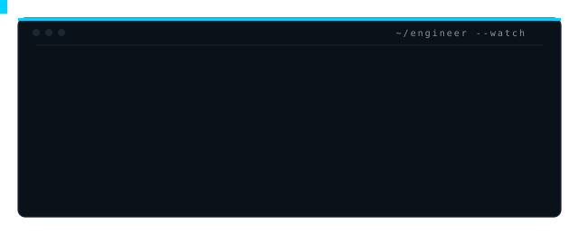
</div>

<br/>


## `~/control-room`

<table>
<tr>
<td valign="top" width="66%">


</td>
<td valign="top" width="34%">

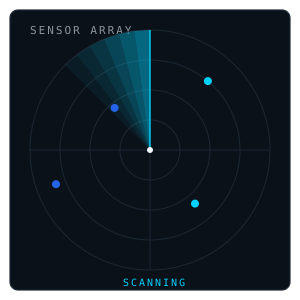

</td>
</tr>
</table>

<div align="center">
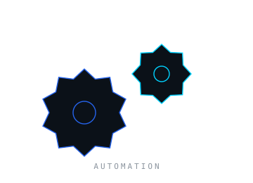
</div>


## `~/whoami`

<div align="center">
</div>

<br/>

## `~/core-concept`

```text
I don't just write software.
I design systems.
```

<div align="center">
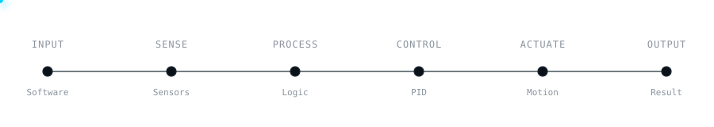
</div>

<br/>

## `~/the-engineer-loop`

<div align="center">
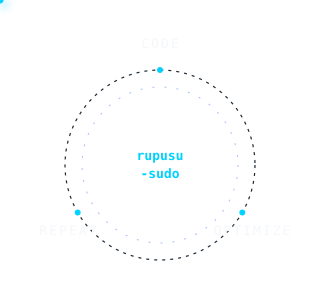
</div>


## `~/robotics`

`ACADEMIC` · `EXPLORING` — coursework and self-directed learning, not a professional deployment.

<div align="center">
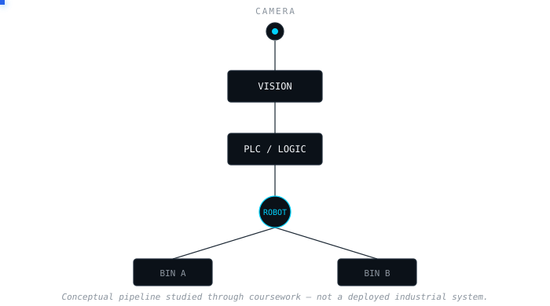
</div>

<br/>

## `~/skills`

<div align="center">
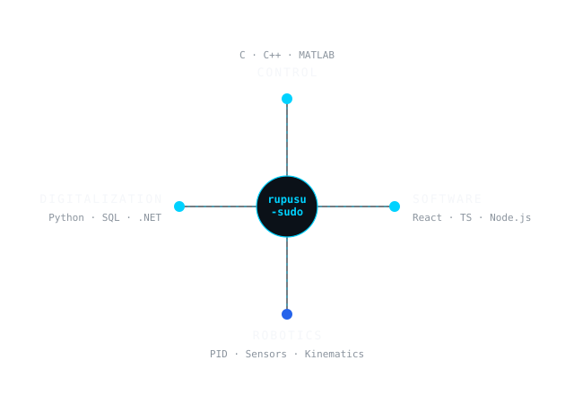
</div>


## `~/projects`

<div align="center">
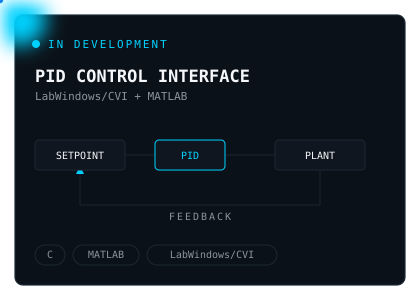
</div>

<br/>

<div align="center">
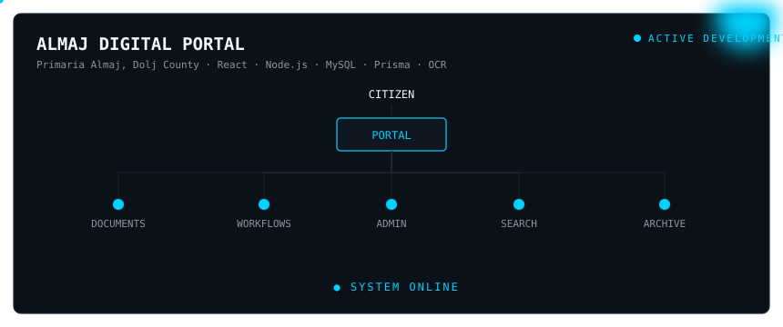
</div>

<br/>

## `~/system-metrics`

<div align="center">
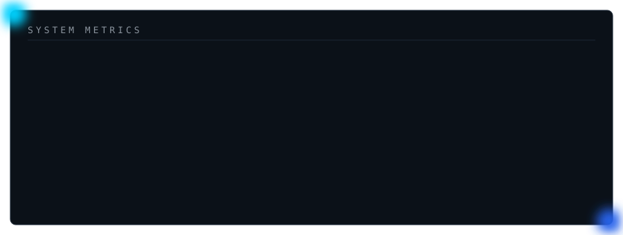
</div>


## `~/roadmap`

<div align="center">
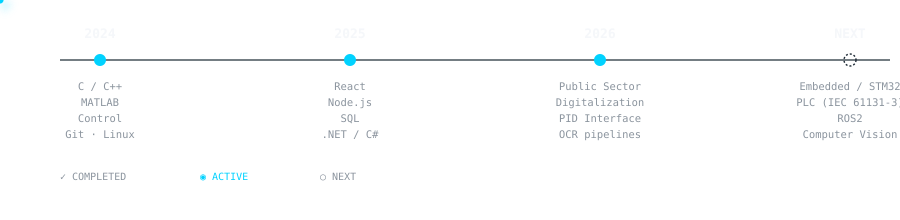
</div>

<br/>

<div align="center">
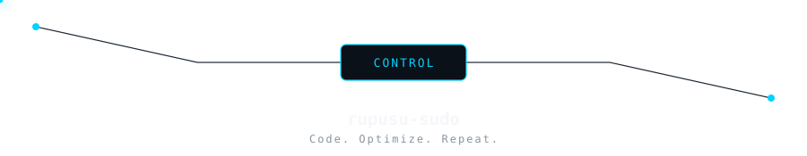
</div>

<br/>

## `~/connect`

<div align="center">

[](https://linkedin.com/in/ionut-marian-falcoi-303510331)
[](https://instagram.com/ruppz1)
[](https://reddit.com/user/ruppz1337)

</div>


